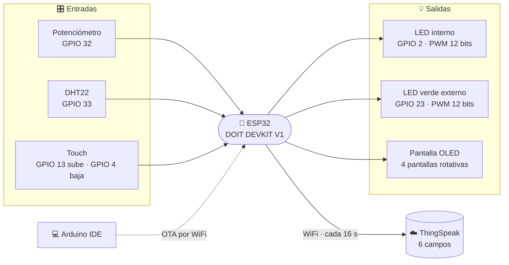

<div align="center">

# 📡 TP IoT - UTN FRC 4K2 2026 · Grupo 06

**Medir, mostrar y publicar en la nube los datos de la placa UTN.**


</div>

---

## 🧭 ¿Qué hace?

La ESP32 lee los sensores de la placa DOIT ESP32 DEVKIT V1, controla dos LEDs, muestra todo en la pantalla OLED y **cada 16 segundos** manda los datos a un canal público de ThingSpeak.

| # | Pedido del enunciado | Cómo lo resuelve |
|:-:|---|---|
| 1 | Brillo del **LED integrado** con el potenciómetro (12 bits) | El valor del pote (0–4095) va directo al PWM del LED |
| 2 | **Temperatura y humedad** en tiempo real | Lectura del DHT22 cada 2 s, mostrada en pantalla |
| 3 | Brillo del **LED externo** con dos pines touch (12 bits) | Pin 13 sube, pin 4 baja; se muestra el porcentaje |
| 4 | **Envío a ThingSpeak** cada 16 s | 6 campos por HTTP GET, con reintento si falla |
| ➕ | Actualización **OTA** | Permite subir el Sketch 2 por WiFi, sin cable |

---

## 🗺️ Cómo funciona



---

## 🔌 Hardware — pines de la placa UTN

| Componente | GPIO | Detalle |
|---|:-:|---|
| Potenciómetro | `32` | Entrada analógica ADC1 (ADC2 no funciona con WiFi activo) |
| Sensor DHT22 | `33` | Temperatura y humedad, salida digital |
| LED integrado (azul) | `2` | PWM 12 bits |
| LED verde externo | `23` | PWM 12 bits |
| Touch "sube" | `13` | Interrupción por hardware |
| Touch "baja" | `4` | Interrupción por hardware |
| Pantalla OLED SH1106 | `21` SDA · `22` SCL | I2C, 128×64 px |

> ⚠️ Alimentar la placa **solo por USB**. USB y VIN al mismo tiempo pueden quemarla.

---

## ☁️ Datos enviados a ThingSpeak

Canal público: **[thingspeak.com/channels/3491303](https://thingspeak.com/channels/3491303)**

| Field | Nombre | Valor |
|:-:|---|---|
| 1 | `Aleatorio` | Número aleatorio entre 100 y 500 |
| 2 | `Temperatura` | °C del DHT22 |
| 3 | `Humedad` | % de humedad relativa |
| 4 | `Uptime_s` | Segundos desde que arrancó la placa |
| 5 | `PWM_LED_Interno` | 0 a 4095 |
| 6 | `Brillo_LED_Externo` | 0 a 100 % |

**Si un envío falla**, el monitor serie dice por qué (sin WiFi, error de conexión o envío rechazado) y se reintenta una vez a los 5 s.

---

## 🖥️ Pantallas

Cada pantalla muestra un dato en grande y cambia sola cada **4 s**. Si movés el pote o tocás un touch, salta a esa pantalla y queda fija **10 s**.

| Pantalla | Número grande | Debajo |
|---|---|---|
| **CLIMA** | Temperatura | Humedad + barra |
| **LED INTERNO** | Valor PWM (0–4095) | Barra + escala |
| **LED EXTERNO** | Brillo (%) | Qué pin sube y cuál baja + barra |
| **THINGSPEAK** | Segundos al próximo envío | Envíos OK / con error · WiFi · tiempo encendida |

```
+---------------------+
|LED INTERNO    o*oo  |   ← título y página actual
|        2048         |   ← dato principal en grande
|---------------------|
| [#########.........]|
| 0     PWM 12b   4095|
|_________            |   ← barra de tiempo hasta la próxima pantalla
+---------------------+
```

---

## 🚀 Cómo usarlo

**1. Instalar en Arduino IDE 2**
- Placa: `esp32` de Espressif → **DOIT ESP32 DEVKIT V1**
- Librerías: `Adafruit SH110X`, `Adafruit GFX Library`, `DHT sensor library`, `Adafruit Unified Sensor`

**2. Completar las credenciales** al principio de `sketch1/sketch1.ino`

```cpp
const char* WIFI_SSID        = "tu_red";     // red de 2.4 GHz
const char* WIFI_PASS        = "tu_clave";
const char* TS_WRITE_API_KEY = "tu_api_key"; // Write API Key del canal
```

**3. Subir la primera vez por USB** y abrir el monitor serie a `115200`.

**4. Las siguientes veces se puede subir por WiFi (OTA):** en *Herramientas → Puerto* aparece `esp32-Grupo06`.

---

## ⚙️ Parámetros que se pueden ajustar

| Constante | Valor | Para qué sirve |
|---|:-:|---|
| `TOUCH_UMBRAL` | `600` | Sin tocar el pin lee ~1000 y tocándolo ~400: por debajo de 600 cuenta como toque |
| `TOUCH_PASO` | `136` | Cuánto cambia el brillo por paso (0 → 100 % en ~3 s) |
| `POTE_HISTERESIS` | `16` | Cambio mínimo del pote para actualizar; evita que el número "baile" por ruido |
| `MS_ENVIO` | `16000` | Intervalo de envío (ThingSpeak gratuito exige 15 s como mínimo) |
| `MS_PANTALLA` | `4000` | Tiempo de cada pantalla |
| `LOG_TOUCH` | `1` | Muestra los valores del touch por serie; poner `0` al terminar de probar |

---

## 📁 Estructura

```
TP/
├── sketch1/
│   └── sketch1.ino                        ← Sketch 1: toma y envío de datos
├── datos_grupo_06.txt                     ← integrantes y datos del canal
├── TP Integrador - IoT - 4K2 - 2026.pdf   ← enunciado
└── README.md
```

---

<div align="center">

**Grupo 06** · UTN FRC · Tecnologías para la Automatización · 2026

</div>
