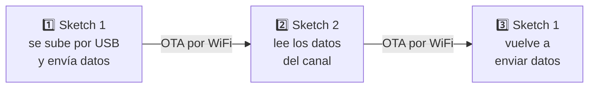
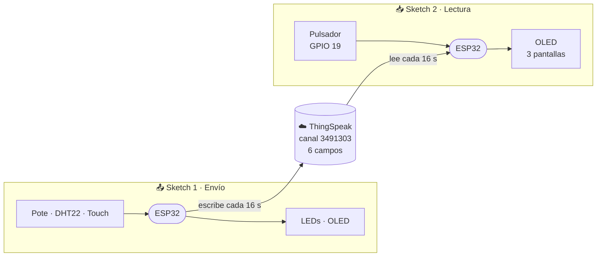

<div align="center">

# 📡 TP IoT - UTN FRC 4K2 2026 · Grupo 06

**Una ESP32 que envía datos a la nube, se actualiza por WiFi y los vuelve a leer.**

Comunicación bidireccional ESP32 ↔ ThingSpeak con programación OTA


</div>

---

## 🧭 ¿De qué se trata?

El trabajo tiene **dos sketches** que corren, uno por vez, en **la misma placa**:

| Sketch | Archivo | Qué hace |
|:-:|---|---|
| 📤 **1 · Envío** | `sketch_envio_grupo_6.ino` | Lee los sensores de la placa, controla dos LEDs y **escribe** 6 datos en ThingSpeak cada 16 s |
| 📥 **2 · Lectura** | `sketch_lectura_grupo_6.ino` | **Lee** esos mismos 6 datos desde ThingSpeak, los muestra en pantalla y cuenta las pulsaciones de un botón |

Para pasar de un sketch al otro **no se usa el cable**: la placa se actualiza por WiFi (OTA).

---

## 🔄 El ciclo completo



## 🗺️ Cómo viajan los datos



---

## 🔌 Hardware — pines de la placa UTN

| Componente | GPIO | Lo usa | Detalle |
|---|:-:|:-:|---|
| Potenciómetro | `32` | Sketch 1 | Entrada analógica ADC1 (ADC2 no funciona con WiFi activo) |
| Sensor DHT22 | `33` | Sketch 1 | Temperatura y humedad, salida digital |
| LED integrado (azul) | `2` | Sketch 1 | PWM 12 bits |
| LED verde externo | `23` | Sketch 1 | PWM 12 bits |
| Touch "sube" | `13` | Sketch 1 | Interrupción por hardware |
| Touch "baja" | `4` | Sketch 1 | Interrupción por hardware |
| Pulsador | `19` | Sketch 2 | `INPUT_PULLUP` |
| Pantalla OLED SH1106 | `21` SDA · `22` SCL | Ambos | I2C, 128×64 px |

> ⚠️ Alimentar la placa **solo por USB**. USB y VIN al mismo tiempo pueden quemarla.

---

## ☁️ El canal de ThingSpeak

Canal público: **[thingspeak.com/channels/3491303](https://thingspeak.com/channels/3491303)**

Es el punto de encuentro entre los dos sketches: el 1 escribe y el 2 lee los mismos campos.

| Field | Nombre | Valor |
|:-:|---|---|
| 1 | `Aleatorio` | Número aleatorio entre 100 y 500 |
| 2 | `Temperatura` | °C del DHT22 |
| 3 | `Humedad` | % de humedad relativa |
| 4 | `Uptime_s` | Segundos desde que arrancó la placa |
| 5 | `PWM_LED_Interno` | 0 a 4095 |
| 6 | `Brillo_LED_Externo` | 0 a 100 % |

---

## 📤 Sketch 1 — Toma y envío de datos

| # | Pedido del enunciado | Cómo lo resuelve |
|:-:|---|---|
| 1 | Brillo del **LED integrado** con el potenciómetro (12 bits) | El valor del pote (0–4095) va directo al PWM del LED |
| 2 | **Temperatura y humedad** en tiempo real | Lectura del DHT22 cada 2 s, mostrada en pantalla |
| 3 | Brillo del **LED externo** con dos pines touch (12 bits) | Pin 13 sube, pin 4 baja; se muestra el porcentaje |
| 4 | **Envío a ThingSpeak** cada 16 s | 6 campos por HTTP GET, con reintento si falla |
| ➕ | Actualización **OTA** | Permite subir el Sketch 2 por WiFi |

### Pantallas

Rotan solas **CLIMA ↔ THINGSPEAK** cada **2 s**. Las pantallas del pote y del touch aparecen **solo cuando se accionan** y quedan **5 s**.

| Pantalla | Cuándo se ve | Número grande | Debajo |
|---|---|---|---|
| **CLIMA** | Siempre (rotación) | Temperatura | Humedad + barra |
| **THINGSPEAK** | Siempre (rotación) | Segundos al próximo envío | Envíos OK / con error · WiFi · tiempo encendida |
| **LED INTERNO** | Al mover el pote | Valor PWM (0–4095) | Barra + escala |
| **LED EXTERNO** | Al tocar pin 13 o 4 | Brillo (%) | Qué pin sube y cuál baja + barra |

```
+---------------------+
|CLIMA            *o  |   ← título y página actual
|       26.6 C        |   ← dato principal en grande
|---------------------|
| HUMEDAD      45.2 % |
| [########..........]|
|_________            |   ← barra de tiempo hasta la próxima pantalla
+---------------------+
```

**Si un envío falla**, el monitor serie dice por qué (sin WiFi, error de conexión o envío rechazado) y se reintenta una vez a los 5 s.

---

## 📥 Sketch 2 — Lectura desde ThingSpeak

| # | Pedido del enunciado | Cómo lo resuelve |
|:-:|---|---|
| 1 | **Leer datos** del mismo canal | `ThingSpeak.readMultipleFields()` cada 16 s, sin API key porque el canal es público |
| 2 | **Contar las pulsaciones** del pulsador | Detecta el paso de HIGH a LOW en el GPIO 19 |
| 3 | **Mostrar** los valores y las pulsaciones | 3 pantallas que rotan cada 4 s |
| ➕ | Actualización **OTA** | Permite volver al Sketch 1 por WiFi |

### Pantallas

| Pantalla | Muestra |
|:-:|---|
| **1/3** | Aleatorio · Temperatura · Humedad |
| **2/3** | Tiempo transcurrido · PWM LED interno · Brillo LED externo |
| **3/3** | Cantidad de pulsaciones · estado de la lectura de ThingSpeak |

```
+---------------------+
|Datos ThingSpeak 1/3 |
|---------------------|
|Aleatorio: 243       |
|Temp: 26.6 C         |
|Hum: 45.2 %          |
+---------------------+
```

---

## 🚀 Cómo usarlo

**1. Instalar en Arduino IDE 2**
- Placa: `esp32` de Espressif → **DOIT ESP32 DEVKIT V1**
- Librerías: `Adafruit SH110X`, `Adafruit GFX Library`, `DHT sensor library`, `Adafruit Unified Sensor`, `ThingSpeak`

**2. Completar las credenciales** al principio de cada sketch

```cpp
// Sketch 1
const char* WIFI_SSID        = "tu_red";     // red de 2.4 GHz
const char* WIFI_PASS        = "tu_clave";   // "" si la red no tiene contraseña
const char* TS_WRITE_API_KEY = "tu_api_key"; // Write API Key del canal

// Sketch 2
const char* ssid     = "tu_red";
const char* password = "tu_clave";
```

**3. Recorrer el ciclo del TP**

| Paso | Qué subir | Cómo |
|:-:|---|---|
| 1 | Sketch 1 | Por **USB**. Abrir el monitor serie a `115200` y verificar los envíos |
| 2 | Sketch 2 | Por **OTA**: *Herramientas → Puerto* → `esp32-Grupo06` |
| 3 | Sketch 1 | Por **OTA**, igual que el paso 2 |

> 💡 Los dos sketches usan el mismo nombre OTA (`esp32-Grupo06`), así que el puerto de red es siempre el mismo. Para verlo, **la PC tiene que estar en la misma red WiFi que la placa**. Algunas redes de facultad bloquean esa detección; si el puerto no aparece, usar el hotspot de un celular.

---

## ⚙️ Parámetros que se pueden ajustar

| Sketch | Constante | Valor | Para qué sirve |
|:-:|---|:-:|---|
| 1 | `TOUCH_UMBRAL` | `600` | Sin tocar el pin lee ~1000 y tocándolo ~400: por debajo de 600 cuenta como toque |
| 1 | `TOUCH_PASO` | `136` | Cuánto cambia el brillo por paso (0 → 100 % en ~3 s) |
| 1 | `POTE_HISTERESIS` | `16` | Cambio mínimo del pote para actualizar; evita que el número "baile" por ruido |
| 1 | `MS_ENVIO` | `16000` | Intervalo de envío (ThingSpeak gratuito exige 15 s como mínimo) |
| 1 | `MS_PANTALLA` | `2000` | Tiempo de cada pantalla en la rotación |
| 1 | `MS_FIJA` | `5000` | Cuánto se muestra la pantalla del pote o del touch |
| 1 | `LOG_TOUCH` | `1` | Muestra los valores del touch por serie; poner `0` al terminar de probar |
| 2 | `intervalLectura` | `16000` | Cada cuánto lee el canal |
| 2 | `intervalPantalla` | `4000` | Tiempo de cada pantalla |

---

## 📁 Estructura

```
TP/
├── sketch1/
│   └── sketch_envio_grupo_6/
│       └── sketch_envio_grupo_6.ino       ← Sketch 1: toma y envío de datos
├── sketch2/
│   └── sketch_lectura_grupo_6/
│       └── sketch_lectura_grupo_6.ino     ← Sketch 2: lectura desde ThingSpeak
├── datos_grupo_06.txt                     ← integrantes y datos del canal
├── TP Integrador - IoT - 4K2 - 2026.pdf   ← enunciado
└── README.md
```

---

<div align="center">

**Grupo 06** · UTN FRC · Tecnologías para la Automatización · 2026

</div>
